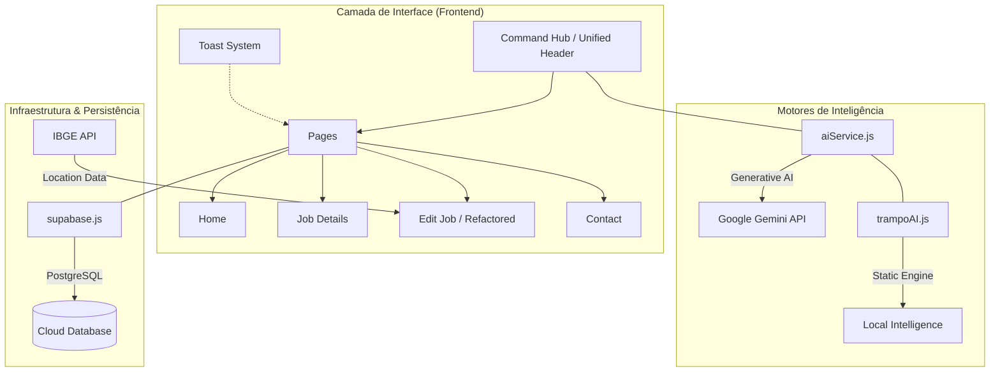

# 🚀 Trampo Fácil — Premium Job Ecosystem

<div align="center">
  
  
  
  <br />
  <br />
  <h3>Recrutamento com Inteligência Real e Design de Alto Impacto</h3>
  <p>Um ecossistema ultra-rápido, orientado a dados e impulsionado por IA Generativa para conectar os melhores talentos às melhores oportunidades – de <b>qualquer área</b>.</p>
</div>

---

## 🧭 Visão Geral

**Trampo Fácil** não é apenas mais um mural de vagas. É uma plataforma projetada para performance extrema e experiência do usuário (UX) de nível empresarial. O projeto utiliza uma arquitetura moderna e refatorada para garantir fluidez total, estabilidade em tempo real e inteligência contextual.

### 💎 Pilares do Projeto
- **Performance de Elite**: Renderização otimizada com Vite 5, refatoração de estados para eliminar *cascading renders* (uso intensivo de `useMemo` e `useCallback`) e carregamento preditivo.
- **Design Premium Tech**: Interface baseada em *Glassmorphism* v4, paletas de cores harmônicas de alto contraste e micro-interações fluidas aceleradas por GPU.
- **Inteligência Contextual**: Integração nativa com o **Google Gemini** através do "Command Hub", fornecendo suporte e análise de mercado em tempo real.
- **Código Ultra-Stable**: 100% livre de erros de linting (ESLint), garantindo uma base de código limpa, escalável e pronta para produção.

---

## ✨ Diferenciais Exclusivos

| Característica | Detalhes |
| :--- | :--- |
| **🚀 Acesso Irrestrito** | Plataforma 100% gratuita, sem paywalls ou barreiras para candidatos. |
| **🧠 Trampo IA (v4.5)** | Motor de IA que gera resumos, dicas de carreira e análise de atratividade de vagas. |
| **⚡ Instant Edit** | Sistema de edição de vagas via tokens de acesso rápido e seguro. |
| **🎨 Glass UI System** | Design System proprietário baseado em transparências e profundidade visual. |
| **📍 Localização Smart** | Integração em tempo real com API IBGE para gestão precisa de cidades e estados. |
| **🔋 Supabase Stack** | Persistência robusta com PostgreSQL e sincronização em tempo real. |

---

## 🏗️ Arquitetura do Sistema



---

## 🗺️ Roadmap de Evolução (2026)

- [ ] **Match Preditivo (P&D)**: IA que antecipa o sucesso de um candidato na cultura da empresa.
- [ ] **Auto-Otimização (Labs)**: Ajuste dinâmico de descrições de vagas com base no mercado em tempo real.
- [ ] **Expansão Global**: Tradução e adaptação cultural automática para recrutamento internacional.
- [ ] **Dashboard de Recrutador v2**: Análise profunda de KPIs e sentiment analysis de candidaturas.

---

## 💻 Stack Tecnológico

- **Core**: React 19 + Vite 5 (HMR Safe)
- **Routing**: React Router v7
- **Database**: Supabase (PostgreSQL)
- **AI**: Google Gemini API (`@google/generative-ai`)
- **Styling**: Vanilla CSS Avançado (Custom Properties, Glassmorphism, GPU Animations)
- **Icons**: Lucide React
- **Toast Engine**: Context API + Portals (HMR optimized)

---

## 🚀 Como Executar o Projeto

### 📋 Pré-requisitos
- **Node.js**: v20.x ou superior
- **Package Manager**: NPM ou Yarn

### 🛠️ Instalação
1.  **Clonar o repositório**:
    ```bash
    git clone https://github.com/lukaslimna1/TrampoFacil.git
    cd TrampoFacil
    ```
2.  **Instalar dependências**:
    ```bash
    npm install
    ```

### ⚙️ Configuração
Crie um arquivo `.env` na raiz do projeto e preencha as credenciais:
```env
VITE_SUPABASE_URL=seu_url_do_supabase
VITE_SUPABASE_ANON_KEY=sua_chave_anonima
VITE_GEMINI_API_KEY=sua_chave_do_gemini # Opcional
```

### 📡 Execução
```bash
# Rodar em modo desenvolvimento
npm run dev

# Validar integridade do código (Lint)
npm run lint
```
Acesse localmente em: `http://localhost:5173`

---

## 🤝 Contribuição

Interessado em evoluir o **Trampo Fácil**?
1. Faça um **Fork** do projeto.
2. Crie uma **Branch** para sua feature (`git checkout -b feature/nova-funcionalidade`).
3. Faça o **Commit** das alterações (`git commit -m 'Add: nova funcionalidade'`).
4. Envie para o repositório (`git push origin feature/nova-funcionalidade`).
5. Abre um **Pull Request**.

---

## 📄 Licença

Este projeto é distribuído sob a **MIT License**. Veja o arquivo [LICENSE](LICENSE) para mais detalhes.

---

<div align="center">
  <p><b>Trampo Fácil</b> — Simplificando e humanizando o próximo passo da sua carreira.</p>
  <p>Desenvolvido com 💙 para conectar pessoas.</p>
</div>
