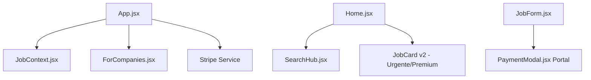

# 🚀 Trampo Fácil — Descoberta Inteligente de Oportunidades

<div align="center">
  
  
  
  
  <br /><br />
  <h3>Encontre ou publique uma vaga em segundos — sem cadastro, sem burocracia.</h3>
  <p>Velocidade, simplicidade e inteligência aplicadas ao mundo real do trabalho.</p>
</div>

---

## ⚡ Sistema Sem Cadastro (Accountless)

O maior diferencial do Trampo Fácil é eliminar a necessidade de contas e senhas.

| Usuário | Como funciona |
|---|---|
| **Empresas** | Publicam vagas através do formulário *PublishJob*. Cada vaga recebe um **token exclusivo** que gera um link seguro (`/vaga/:id?token=…`). Esse link permite editar ou remover a vaga sem login. |
| **Candidatos** | Acessam imediatamente todas as funcionalidades (busca, filtros, aplicação) sem precisar criar conta. |
| **Privacidade** | Nenhum dado de login é armazenado; apenas o token da vaga é mantido no banco. |

---

## 💎 Identidade Visual Premium (v5.2)

A v5.2 introduz um refinamento completo na marca e na experiência de monetização:

*   **Destaque Premium (Gem)**: O ícone de diamante foi substituído pela **Gema Detalhada**, transmitindo uma percepção de valor superior para vagas VIP.
*   **Vaga Urgente (Golden Flame)**: Implementação do **Fogo Dourado**, unificando a paleta de cores dos produtos pagos em tons de ouro e âmbar (`#F59E0B`).
*   **Payment Modal v2**: Novo modal de pagamento interativo utilizando `React Portal`, garantindo que o checkout esteja sempre acima de qualquer elemento da UI, com design de vidro e feedback em tempo real.

---

## 💳 Integração com Stripe

O motor de monetização está agora 100% operacional com o Stripe:

*   **Checkout Dinâmico**: Geração automática de sessões de pagamento conforme o plano escolhido (Urgente, Premium ou Combo).
*   **Planos Cumulativos**: Lógica inteligente de soma de valores para contratação de múltiplos destaques simultaneamente.
*   **Segurança**: Processamento seguro via Stripe API, com redirecionamento automático e confirmação de status.

---

## 🛡️ Central de Transparência & Compliance

A partir da v4.9, introduzimos uma arquitetura modular de conformidade e segurança:

*   **Arquitetura Modular**: Documentação jurídica dividida em módulos (`Security`, `Privacy`, `Terms`, `FAQ`) para fácil manutenção.
*   **FAQ Interativo**: Sistema de respostas expansíveis (Accordion) inspirado em plataformas premium.
*   **Contato Inteligente**: Suporte otimizado com perfis de atendimento (Denúncia de Vagas, LGPD, Parcerias).

---

## 🧠 Inteligência Trampo IA

O motor `Trampo IA` (Gemini 1.5 Flash) foi sincronizado em toda a plataforma:

| Feature | O que entrega ao usuário |
|---|---|
| **Saudações Contextuais** | Mensagens inteligentes que mudam conforme a página (Contato, Legal, Home, Empresas) e detectam o contexto da navegação. |
| **Score de Performance** | Avaliação 0-100 baseada em clareza, benefícios e inclusão, impulsionando vagas de alta qualidade. |
| **Recruiter Insights** | Feedback em tempo real durante a criação da vaga para maximizar a atratividade. |

---

## 📊 Painel Técnico (Stack 2026)

| Característica | Detalhe | Impacto no Produto |
|---|---|---|
| **Arquitetura** | React 19 + Context API | Interface que nunca trava e estado sincronizado. |
| **Layout Expansivo** | Grid Ultra-Wide + Home 40/60 Split | Aproveitamento total de espaço para feed e preview simultâneos. |
| **Portals** | React DOM createPortal | Modais de pagamento que escapam do contexto de stacking para 100% de visibilidade. |
| **Branding Unificado** | Lucide-React v0.400+ | Ícones padronizados (Gem/Flame) em toda a jornada do usuário. |

---

## 🏗️ Estrutura do Projeto



---

## 📈 Roadmap de Evolução

### ✅ Concluído
- **v5.0** – Landing Page para Empresas + Sincronização de Terminologia.
- **v5.1** – Filtro Em Alta (Stories) unificando Urgência e Destaques.
- **v5.2** – **Integração Real Stripe** + Branding Otimizado (Gem/Golden Flame) + Payment Modal v2.

### 🚀 Próximas Evoluções
- **Dashboard de Métricas** – Visualização de cliques e alcances para recrutadores.
- **Navegação Geográfica** – Filtros avançados por cidades/estados (SEO Local).
- **Match Inteligente v2** – Recomendação proativa de candidatos baseada no Score IA.

---

## 📦 Como Rodar o Projeto Localmente

```bash
# 1️⃣ Instalar e Iniciar
git clone https://github.com/SEU-USUARIO/trampo-facil.git
cd trampo-facil
npm install
npm run dev
```

---

<div align="center">
  <p><b>Trampo Fácil</b> — Onde a tecnologia simplifica a sua próxima conquista.</p>
  <p><i>Foco em simplicidade. Paixão por resultados.</i></p>
</div>

