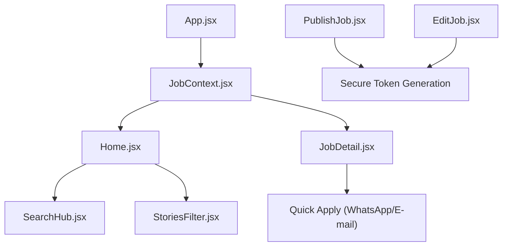

# 🚀 Trampo Fácil — Descoberta Inteligente de Oportunidades

<div align="center">
  
  
  
  
  <br /><br />
  <h3>Encontre ou publique uma vaga em segundos — sem cadastro, sem burocracia.</h3>
  <p>Velocidade, simplicidade e inteligência aplicadas ao mundo real do trabalho.</p>
</div>

---

## ⚡ Sistema Sem Cadastro (Accountless)

O maior diferencial do Trampo Fácil é eliminar a necessidade de contas e senhas.

| Usuário | Como funciona |
|---|---|
| **Empresas** | Publicam vagas através do formulário *PublishJob*. Cada vaga recebe um **token exclusivo** que gera um link seguro (`/vaga/:id?token=…`). Esse link permite editar ou remover a vaga sem login. |
| **Candidatos** | Acessam imediatamente todas as funcionalidades (busca, filtros, aplicação) sem precisar criar conta. |
| **Privacidade** | Nenhum dado de login é armazenado; apenas o token da vaga é mantido no banco. |

> Este modelo elimina uma das maiores barreiras das plataformas tradicionais: o cadastro obrigatório.

---

## 🔄 Como Funciona

1. **🔎 Descubra** – Busca por texto livre ou filtros rápidos (localização, modalidade, salário, etc.).
2. **📄 Visualização** – *Split‑View* (lista + detalhes) para desktop; navegação simples em mobile.
3. **🧾 Aplicação** – Clique em **WhatsApp**, **E‑mail** ou link externo; candidatura em um único clique.
4. **✏️ Gerenciamento** – O recrutador recebe um link seguro e pode editar ou remover a vaga a qualquer momento.

---

## 🧠 Inteligência Trampo IA

O módulo `src/utils/trampoAI.js` alimenta duas áreas principais:

| Feature | O que entrega ao usuário |
|---|---|
| **Saudações Humanizadas** | Mensagens contextuais exibidas no cabeçalho (`AIGreeting`) que mudam conforme a página e hora do dia. |
| **Avaliação de Vagas** | Um *score* de 0‑100 que considera clareza da descrição, presença de benefícios, inclusão e aderência a parâmetros de mercado (salário, senioridade). O *score* movimenta badges como **“Em Alta”**. |

A IA utiliza Gemini 1.5 Flash principalmente para interpretação de linguagem natural (ex.: “vaga de dev remoto em SP”) – não é um pipeline completo de NLP de produção.

---

## 📊 Painel Técnico

| Característica | Detalhe | Impacto no Produto |
|---|---|---|
| **Arquitetura** | React 19 + Context API | Interface que nunca trava e estado sincronizado. |
| **Performance** | Snappy UX (0.2 s transitions) | Sensação de aplicativo nativo e ultra‑rápido. |
| **Persistência** | Supabase Real‑time | Vagas atualizadas instantaneamente para todos. |
| **Interface** | Glassmorphism v4 | Experiência moderna e diferenciada. |
| **Tokenização** | `token_edicao` (hash SHA‑256) gerado ao publicar | Permite edição via link seguro – pilar **Accountless**. |

---

## 🏗️ Estrutura do Projeto



- **`JobContext.jsx`** – Gerencia jobs, favoritos, contagem de visualizações e detecção de *hot*.
- **`ToastContext.jsx`** – Sistema global de mensagens temporárias.
- **`AIGreeting.jsx`** – Saudações dinâmicas baseadas em Gemini.
- **Componentes UI** – `JobCard`, `JobCardSkeleton`, `JobDetailSkeleton`, `BottomNav`, `Footer`, etc., todos com **glass‑morphism** e micro‑animações.

---

## 📈 Roadmap de Evolução

### ✅ Concluído
- **v4.0** – Design Tech‑Premium (Glassmorphism)
- **v4.5** – Busca Inteligente com **interpretação de linguagem natural** (Gemini)
- **v4.8** – Snappy UX + Layout Ultra‑Wide

### 🚀 Próximas Evoluções
- **Navegação Geográfica** – Filtros avançados por cidades/estados (SEO + descoberta).
- **Métricas de Vagas** – Dashboard de visualizações e interações para recrutadores.
- **Contas Opcionais** – Usuário pode criar conta para histórico persistente, mas não é obrigatório.
- **Notificações Inteligentes** – Alertas por e‑mail/WhatsApp quando novas vagas correspondem ao perfil.
- **Otimizador de Vagas (IA)** – Sugestões em tempo real para melhorar descrição, salário e benefícios.
- **Busca Semântica Avançada** – Melhor interpretação de requisitos e contexto das vagas.
- **Gerador de Currículos** – Criação automática de CV otimizado para a vaga selecionada.

---

## 📦 Como Rodar o Projeto Localmente

### Requisitos
Node.js 20+

```bash
# 1️⃣ Clonar o repositório
git clone https://github.com/SEU-USUARIO/trampo-facil.git
cd trampo-facil

# 2️⃣ Instalar dependências
npm install

# 3️⃣ Configurar variáveis de ambiente (.env)
VITE_SUPABASE_URL=https://YOUR-PROJECT.supabase.co
VITE_SUPABASE_ANON_KEY=YOUR-ANON-KEY
VITE_GEMINI_API_KEY=YOUR-GEMINI-KEY

# 4️⃣ Iniciar o servidor de desenvolvimento
npm run dev
```

A aplicação será servida em `http://localhost:5173`.

---

## 👀 Preview


---

<div align="center">
  <p><b>Trampo Fácil</b> — Onde a tecnologia simplifica a sua próxima conquista.</p>
  <p><i>Foco em simplicidade. Paixão por resultados.</i></p>
</div>
