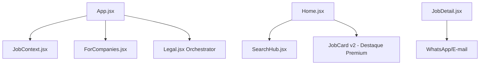

# 🚀 Trampo Fácil — Descoberta Inteligente de Oportunidades

<div align="center">
  
  
  
  
  <br /><br />
  <h3>Encontre ou publique uma vaga em segundos — sem cadastro, sem burocracia.</h3>
  <p>Velocidade, simplicidade e inteligência aplicadas ao mundo real do trabalho.</p>
</div>

---

## ⚡ Sistema Sem Cadastro (Accountless)

O maior diferencial do Trampo Fácil é eliminar a necessidade de contas e senhas.

| Usuário | Como funciona |
|---|---|
| **Empresas** | Publicam vagas através do formulário *PublishJob*. Cada vaga recebe um **token exclusivo** que gera um link seguro (`/vaga/:id?token=…`). Esse link permite editar ou remover a vaga sem login. |
| **Candidatos** | Acessam imediatamente todas as funcionalidades (busca, filtros, aplicação) sem precisar criar conta. |
| **Privacidade** | Nenhum dado de login é armazenado; apenas o token da vaga é mantido no banco. |

---

## 🚀 Landing Page "Para Empresas" (v5.0)

A v5.0 foca na expansão B2B com uma nova experiência para recrutadores:

*   **Página "Para Empresas"**: Nova landing page de conversão com seções de Hero, Roadmap, IA e Diferenciais.
*   **Monetização & Destaques**: Integração dos planos **Vaga Urgente** (Hot status) e **Destaque Premium** (Borda dourada/VIP) para máxima visibilidade.
*   **Fluxo de Pagamento**: Preparado para integração com **Stripe** para processamento automático de destaques.

---

## 🛡️ Central de Transparência & Compliance

A partir da v4.9, introduzimos uma arquitetura modular de conformidade e segurança:

*   **Arquitetura Modular**: Documentação jurídica dividida em módulos (`Security`, `Privacy`, `Terms`, `FAQ`) para fácil manutenção.
*   **FAQ Interativo**: Sistema de respostas expansíveis (Accordion) inspirado em plataformas premium.
*   **Contato Inteligente**: Suporte otimizado com perfis de atendimento (Denúncia de Vagas, LGPD, Parcerias).

---

## 🧠 Inteligência Trampo IA

O motor `Trampo IA` (Gemini 1.5 Flash) foi sincronizado em toda a plataforma:

| Feature | O que entrega ao usuário |
|---|---|
| **Saudações Contextuais** | Mensagens inteligentes que mudam conforme a página (Contato, Legal, Home, Empresas) e detectam o contexto da navegação. |
| **Score de Performance** | Avaliação 0-100 baseada em clareza, benefícios e inclusão, impulsionando vagas de alta qualidade. |
| **Recruiter Insights** | Feedback em tempo real durante a criação da vaga para maximizar a atratividade. |

---

## 📊 Painel Técnico (Stack 2026)

| Característica | Detalhe | Impacto no Produto |
|---|---|---|
| **Arquitetura** | React 19 + Context API | Interface que nunca trava e estado sincronizado. |
| **Layout Expansivo** | Grid Ultra-Wide + Home 40/60 Split | Aproveitamento total de espaço para feed e preview simultâneos. |
| **Persistência** | Supabase Real-time | Vagas e visualizações atualizadas instantaneamente. |
| **Documentação** | JSDoc + Comentários de Objetivo | Código 100% autodocumentado em todos os arquivos. |
| **Job Cards v2** | Spacious Design (32px padding) | Maior legibilidade e suporte para **Destaque Premium**. |

---

## 🏗️ Estrutura do Projeto



---

## 📈 Roadmap de Evolução

### ✅ Concluído
- **v4.9** – Central de Transparência Modular + Design de Cards Otimizado
- **v5.0** – **Landing Page para Empresas** + Sincronização de Destaques Premium

### 🚀 Próximas Evoluções
- **Dashboard do Recrutador** – Centralização da gestão de vagas e métricas.
- **Checkout Stripe** – Integração real para ativação de destaques pagos.
- **Navegação Geográfica** – Filtros avançados por cidades/estados (SEO Local).

---

## 📦 Como Rodar o Projeto Localmente

```bash
# 1️⃣ Instalar e Iniciar
git clone https://github.com/SEU-USUARIO/trampo-facil.git
cd trampo-facil
npm install
npm run dev
```

---

<div align="center">
  <p><b>Trampo Fácil</b> — Onde a tecnologia simplifica a sua próxima conquista.</p>
  <p><i>Foco em simplicidade. Paixão por resultados.</i></p>
</div>
